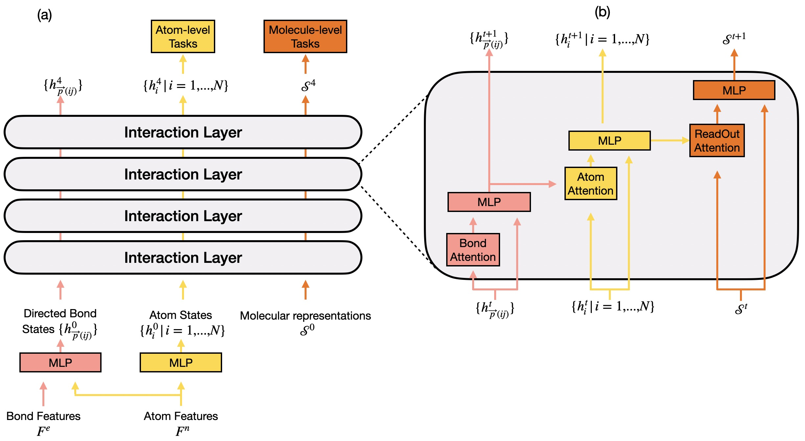
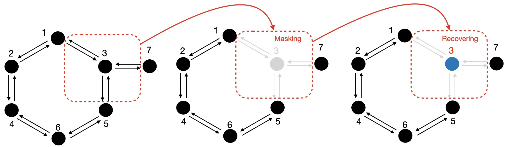
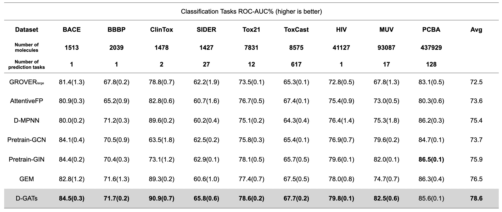
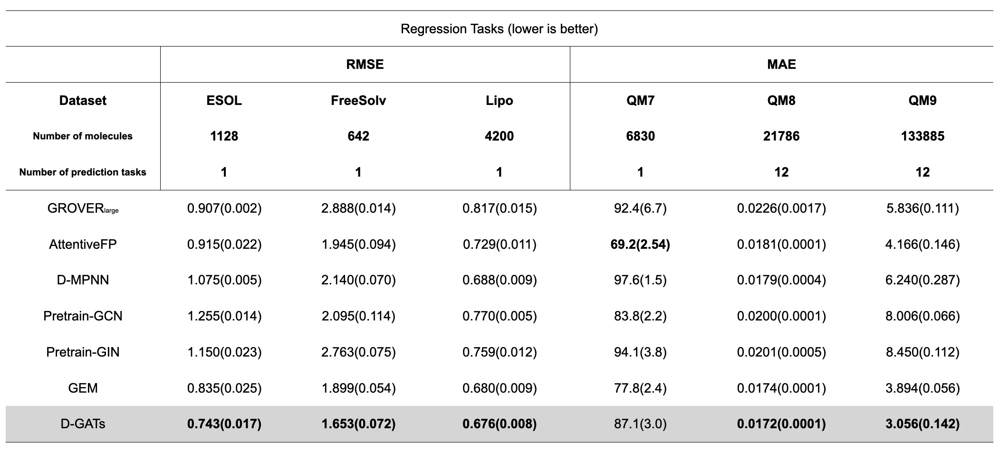

Dependencies
------------

To run the code, it requires jupyter, rdkit and pytorch.

We adive the following environment:
```
conda create -n D_GATs python=3.8
conda activate D_GATs
conda install jupyter
conda install -c rdkit rdkit
conda install pytorch-gpu
```

Directed Message Passing Based on Attention for Prediction of Molecular Properties
===================================================================

Authors: Gong CHEN, Yvon MADAY

D-GATs follow the common framework of MPNNs and explore a bond-level message passing algorithm completely relying on scaled dot-product attention mechanism, which outperforms SOTA baselines on 13/15 molecular property prediction tasks on the MoleculeNet benchmark.

<p align="center"></p>

D-GATs' pre-training strategy
------------------------------


<p align="center"></p>

D-GATs' performance
------------------------------

<p align="center"></p>
<p align="center"></p>


Citation
--------

Please kindly cite this paper if you use the data/code/model.
```
not published yet
```

License
-------

This project is licensed under the terms of the MIT license. See [LICENSE](https://github.com/GongCHEN-1995/D-GATs/blob/main/LICENSE) for additional details.
